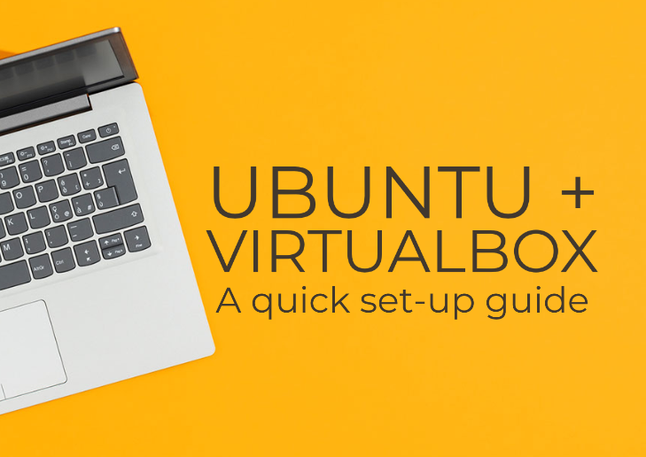
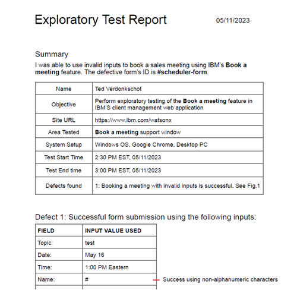
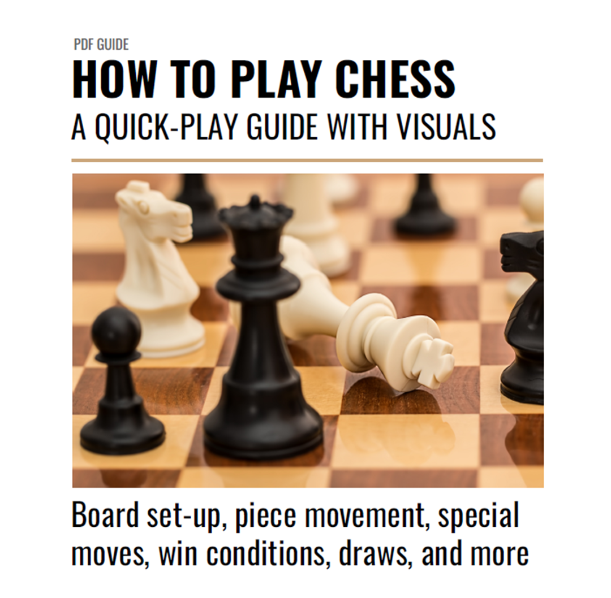

Thanks for reviewing my portfolio. Below are my technical writing samples.

# Guide: Install Ubuntu on a Virtual Machine

[This quick installation guide](https://github.com/Ted-V/portfolio/blob/main/resources/Ubuntu%20VM%20Guide/ubuntu_vm_installation_guide.md) explains how to use Oracle’s VirtualBox software to install Ubuntu Linux on a virtual machine. 

**Background:** Virtual machines fascinate me. Early on in my programming education I was advised to set up a virtual machine where I would do all of my coding work. I thought it was neat to have a separate workspace where I could toy around with Linux and not worry so much about breaking my computer. As an aspiring technical writer, I wrote this guide to gain experience working with Markdown and Snag It. The guide is intended to help someone quickly set up a virtual machine without getting bogged down in configuration.

# Summary Report: Test Session on IBM.com

[This report](resources/ibm_exploratory_test_summary.pdf) summarizes an exploratory test session I performed on IBM.com’s UI. The report highlights a defect in their feature that allows potential clients to book sales meetings.

**Background:** In addition to technical writing, I am interested in software testing and quality assurance. I recently passed ISTQB’s foundation level testing exam and have been practicing testing skills on websites to gain some practical experience. I wrote this report as a way to practice both writing and testing skills. I wrote for an expert audience.

# Game Manual: How to Play Chess

[This game manual](resources/chess_manual.pdf) explains how to play chess to new players. 

The manual covers:
- Pieces
- Board setup
- Special moves
- Win conditions
- Draws

**Background:** I created this guide as a way to practice my documentation skills. As someone desiring to become a technical writer, I was advised to try writing documentation for a household item. Following that advice, I searched my home and found an old chess set that was missing a rulebook. This is my novice attempt at creating that missing rulebook. 

# More Samples
I would be happy to produce more samples upon request. The work above represents my current skill level and where I'm at in my career. Feel free to contact me at tedverdonkschot@outlook.com if you'd like to see more.

# Education
**Bachelor of Science in Philosophy, James Madison University**

**Certificate: ISTQB Certified Tester Foundation Level**

**Udemy, Online Coursework** 
- Business and Technical Writing Immersion
- Web Development Fundamentals: HTML, CSS, JS, and more

# Skills
- OS: Windows, Linux, Mac
- Software: Git, GitHub, VSCode, MSWord, GoogleDocs, Adobe Acrobat, Snag It
- Languages: HTML5, CSS3, Javascript ES6+
- Quick learner
- Good listener
- An eye for design
- Pays attention to details
- Can work in a fast paced environment
