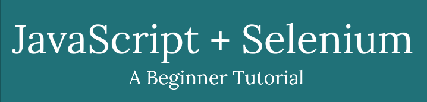
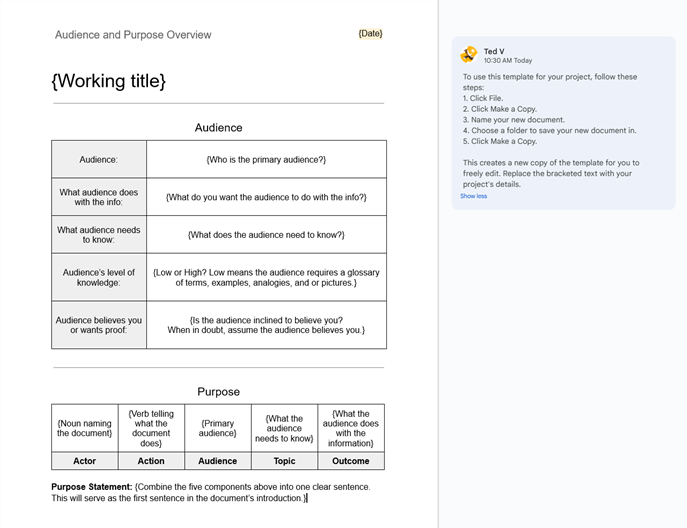

Thanks for reviewing my portfolio. Below are my technical writing samples.

# Selenium WebDriver Tutorial

This [tutorial](https://github.com/Ted-V/portfolio/blob/main/resources/Selenium_JS_Tutorial/seleniumtut.md) explains how to use JavaScript and Selenium WebDriver to write scripts that automate web browser activity. The tutorial is intended for beginners who have a basic understanding of JavaScript. The tutorial uses an example to teach how to use Selenium methods to locate and interact with HTML elements.

**Background:** I began learning Selenium to further my software testing knowledge. Early on in my learning, I had trouble finding a good tutorial written in JavaScript, the programming language I'm most familiar with. After learning the basics of Selenium from multiple sources I decided to write a tutorial of my own. This would help solidify my knowledge. My goal was to write a beginner-friendly tutorial that includes all of the steps necessary to not only set up a project with Selenium, but to actively use its methods in a testing context.

# How to Install Ubuntu on a Virtual Machine

This [how-to guide](https://github.com/Ted-V/portfolio/blob/main/resources/Ubuntu%20VM%20Guide/ubuntu_vm_installation_guide.md) explains how to use Oracle’s VirtualBox software to install Ubuntu Linux on a virtual machine. The guide is task-oriented and it assumes basic computer literacy.

**Background:** Early on in my programming education I was advised to work on my coding projects inside of a virtual machine. I thought it was neat to have a separate workspace where I could toy around with Linux and not worry about breaking my computer. Looking back, I remember being confused about how to set up a virtual machine. This guide is intended to help someone quickly set up a virtual machine without getting bogged down in configuration. Writing this guide gave me experience working with Markdown and Snag It.

# Game Manual: How to Play Chess

This [game manual](resources/Chess_Manual.pdf) explains the rules of chess.

**Background:** I created this guide as a way to practice my documentation skills. As an aspiring technical writer, I was advised to try writing documentation for a household item. Following that advice, I searched my home and found an old chess set that was missing a rulebook. This is my novice attempt at creating that missing rulebook. 

# Template: Audience and Purpose Overview

This [GoogleDocs template](https://docs.google.com/document/d/1FrgzfyifFIkPSuOr0ERs_vaioVlgcjXrBJuEHpS2sq4/edit?usp=sharing) offers writers a way to organize and record essential information about their project's target audience and purpose. The goal of this template is to establish a document's purpose and aim early on in the writing process. The template is free to use and can be easily transferred to a Google drive. 

**Background:** I use this template as a starting point in my writing process. In writing this template I borrowed terminology from Dan Graham's *The Writing System* course. Like Dan, I believe that at the foundation of any well-written document is a clearly defined purpose statement and a careful consideration of the target audience. A document written without these two elements lacks sense and aim. Aimless writing should be avoided in business because it does nothing to achieve objectives, it wastes time, and it can introduce risk.

# Summary Report: Test Session on IBM.com

This [report](resources/ibm_exploratory_test_summary.pdf) summarizes an exploratory test session I performed on IBM.com’s UI. The report highlights a defect in their feature that allows potential clients to book sales meetings.

**Background:** In addition to technical writing, I'm interested in software testing and quality assurance work. I recently passed ISTQB’s foundation exam and I've been practicing my testing skills on various websites to gain practical experience. I wrote this report as a way to practice my writing and testing skills. I wrote for an expert audience.

# More Samples
I would be happy to produce more samples upon request. The work above represents my current skill level and where I'm at in my career. Feel free to contact me at tedverdonkschot@outlook.com if you'd like to see more.

# Education
**Bachelor of Science in Philosophy, James Madison University**

**Certificate: ISTQB Certified Tester Foundation Level**

**Udemy, Online Coursework** 
- Business and Technical Writing Immersion
- Web Development Fundamentals: HTML, CSS, JS, and more

# Skills
- OS: Windows, Linux, and Mac.
- Software: Browser developer tools, Git, GitHub, VS Code, MS Word, GoogleDocs, Adobe Acrobat, and Snag It.
- Languages: Markdown, HTML5, CSS3, and Javascript ES6+.
- Quick learner.
- Good listener.
- Attention to detail.
- Work in a fast-paced environment.
- Distill complex concepts from multiple sources.
