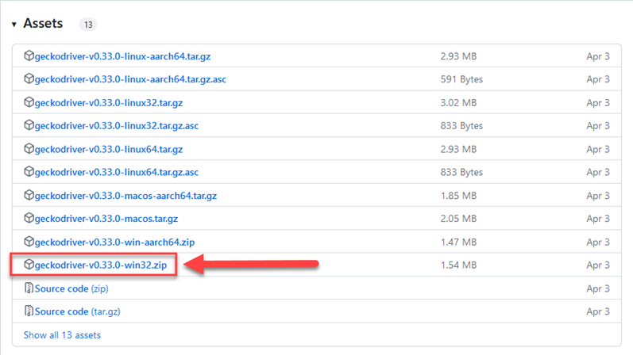
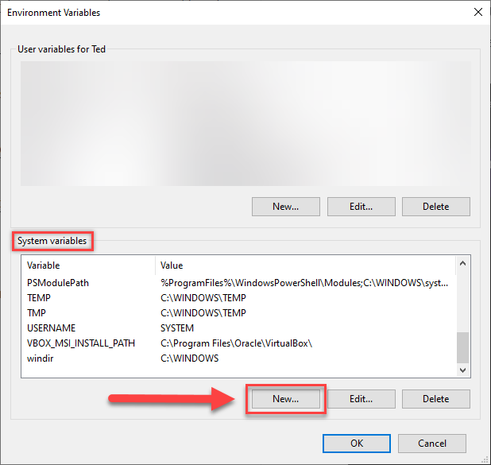
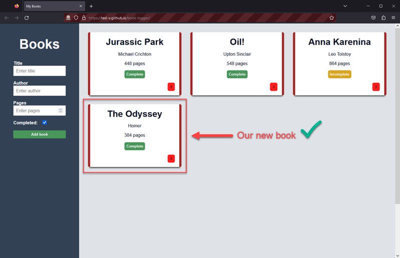

# How to Write and Run Test Scripts Using JavaScript and Selenium Web Driver

## Overview

In this tutorial, you'll learn how to write and run a test script using JavaScript and Selenium Webdriver. This tutorial is intended for beginners who are interested in using Selenium Webdriver as tool to automate web browser activity. Although this tutorial will guide you through most steps, it assumes you have basic knowledge of:

* Operating systems
* JavaScript programming language
* Working in an integrated development environment (IDE)
 
By the end of this tutorial, you'll be able to:

* Set up a project with Selenium 
* Use locators to target elements on a web page
* Write and run a script that automates web browser activity

## Prerequisites

Before we begin, you need to:

* Download and install an IDE. We will be using Visual Studio Code. VS Code is free and beginner-friendly. You can find the latest version [here](https://code.visualstudio.com/). 
* Download and install Node.js and Node Package Manager (NPM). NPM automatically installs with Node. You can find and download the latest versions [here](https://nodejs.org/en/downloadRun).  

# Section 1: Setting Up Our Project
## Step 1: Verify that Node.js and NPM are Installed

To get started, let's verify that you have Node.js and NPM installed. We will use NPM to install Selenium Webdriver in our project. 

1. Open a terminal.

2. Check your version of Node.js and NPM.
   
   2.1. Type `node -v` on the command line and press Enter.

   2.2. Type `npm -v` on the command line and press Enter.

        C:\Users\Ted\Desktop> node -v
        v18.16.0

        C:\Users\Ted\Desktop> npm -v
        9.5.1

    If you do not get a version number after entering these commands, try reinstalling Node.js and NPM. 
## Step 2: Set Up a Project Folder

First we need to set up a root folder for our project. This is where we will install Selenium and later store our script.

1. Open a terminal.  
2. Navigate to your Desktop. 

        C:\Users\Ted> cd Desktop

3. Create a folder and name it `seleniumTutorial`. This is our project folder.

        C:\Users\Ted\Desktop> mkdir seleniumTutorial

4. Open the `seleniumTutorial` folder.

        C:\Users\Ted\Desktop> cd seleniumTutorial

5. Initialize NPM in your project using  `npm init`.

        C:\Users\Ted\Desktop\seleniumTutorial> npm init

6. Configure your package.json file.
   
   After entering `npm init`, you will be asked to configure a package.json file. This file contains information describing our project. For our purposes, we will keep all of the values default. 
   
   6.1. Press enter continously until the package.json file is created.

        {
            "name": "seleniumtutorial",
            "version": "1.0.0",
            "description": "",
            "main": "index.js",
            "scripts": {
                "test": "echo \"Error: no test specified\" && exit 1"
            },
            "author": "",
            "license": "ISC"
        }

7. Install Selenium Webdriver in your project using `npm install selenium-webdriver`.

    Selenium Webdriver itself is a package. NPM helps us easily install this package into our project.  

        C:\Users\Ted\Desktop\seleniumTutorial> npm install selenium-webdriver

    If you'd like, you can navigate to your package.json file and see how its changed. Selenium Webdriver is now listed under `"dependencies"`.
        
        ...
        "dependencies": {
            "selenium-webdriver": "^4.9.2"
        }

## Step 3. Download a Browser Driver

Before we write any scripts with Selenium, we first need a driver that can launch instances of our web browser automatically. Depending on what browser you choose, these steps may vary. We will be using FireFox Web Browser in this tutorial. 

1. Navigate to your desktop.
2. Create a new folder named `drivers`.
3. Download a driver and move it to your `drivers` folder.
   
   3.1. [Click here](https://www.npmjs.com/package/selenium-webdriver) and locate the driver that corresponds to your web browser. Since we are using Firefox,   we will be downloading `geckodriver(.exe)`.

    3.2 Click **geckodriver(.exe)**. You will be redirected to Mozilla's GitHub repo.

    
    
    3.3 Find and download `geckodriver` for your host operating system. We are on Windows, so we will be downloading `geckodriver-v0.33.0-win32.zip`.

    3.4 Click **geckodriver-v0.33.0-win32.zip** to download `geckodriver`.
    

    3.5 Open `geckodriver-v0.33.0-win32.zip`.

    3.6 Move `geckodriver.exe` into your `drivers` folder.

## Step 4: Create a PATH Variable for Your Driver. 
We need to create a new `PATH`  variable so that our scripts can execute  `geckodriver` automatically. This step will vary depending on your operating system. To learn more about `PATH` variables,  [visit here.](https://superuser.com/questions/284342/what-are-path-and-other-environment-variables-and-how-can-i-set-or-use-them)
### Creating a New PATH variable in **Windows** (See below for Mac OS / Linux)

In Windows we can use the GUI to create a new PATH variable. 
   
1.  In the `Start Menu`, search 'view advanced system settings.'

2.  Click **Open**.

    
    
3.  Click **Environment Variables**

    

4. Under **System variables**, Click **new**.

    

5. Enter **'geckodriver'** as the variable name.
6. Enter the path to your **`drivers`** folder as the variable value.
7. Click **OK**. 

    

    Continue to Section 2.

### Creating a New PATH Variable in Linux or Mac OS

1. Open a terminal.
2. Enter the command: `export PATH=$PATH:`**<Enter the path to your `drivers` folder here>**
3. Enter the command: `echo $PATH` to verify that the `PATH` variable was created. You should see the path to your `drivers` folder in the resulting message.

# Section 2: Writing Your First Script
## What We Are Testing        
Our project is set up and we are ready to write our first script. In this tutorial, we will write a script that tests the functionality of the following website: https://ted-v.github.io/book-logger/. On this website, you will find a Book Logger App that lets users add books to a library. There are three example books in the library. 

### Our testing scenario includes the following objectives: 
1.  Visit the Book Logger website.
2. Complete the book form using valid inputs.
3. Submit the book form.

### To achieve our objectives, our script will use Selenium methods to automatically:
* Open the Book Logger website in a separate FireFox instance.
* Locate the Title, Author, Page Number, and Add book element IDs.
* Enter valid Title, Author, and Page Number values.
* Click on the Add book element.

Let's get started.

## Step 1: Create a JavaScript File
1. Open your project in an IDE. We are using Visual Studio Code.
2. Create a new folder and name it `tests`. 

    
3. Navigate to the `tests` folder.
4. Create a new file and name it `firstTest.js`

    

## Step 2: Add a Require Statement

1. Add the following code to the top of your file:
        
        const {Builder, By} = require ("selenium-webdriver");
    
Adding a `require` statement lets us pull what we need out of packages into our project. Recall that Selenium Webdriver is a Node package. Requiring `selenium-webdriver` gives us access to Selenium's methods and key words.

## Step 3: Add a Function

1. Add the following code below the `require` statement:
        
    
         async function firstTest() {
            
        //Our script will go here

        }

        firstTest();

    This function will house the browser activity we want to automate.  

## Step 4: Launching the Browser

1. Add the following code inside the `firstTest()` function:

    
        let driver = await new Builder().forBrowser("firefox").build();

    This code opens a new instance of FireFox web browser.

## Step 5: Navigating to a URL

1. Add the following code inside the `firstTest()` function:

        await driver.get("https://ted-v.github.io/book-logger/")

    This code directs FireFox to a specified URL.

## What we have so far:
You should have the following code in your `firstTest.js` file:

        const {Builder, By} = require ("selenium-webdriver");

        async function demoTest() {
     
        //launch the browser
        let driver = await new Builder().forBrowser("firefox").build();

        //navigate to URL
        await driver.get("https://ted-v.github.io/book-logger/")

        }
  
        firstTest();

Let's try running our script. Follow these steps to run the script: 

1. Open a terminal.

2. Navigate to your tests folder.

        C:\Users\Ted\Desktop\seleniumTutorial\tests>

3. Type the command: `node myFirstTest.js` and press Enter.

        C:\Users\Ted\Desktop\seleniumTutorial\tests> node myFirstTest.js

If successful, a new browser instance will open and navigate to the Book Logger site.

Close the browser. Let's continue adding to our script. 

## Step 6: Locating Elements
If we want our script to complete the book form and add a new book to the library, we first need to identify the HTML elements associated with performing those tasks. The first element we need to identify is the Title input. We will use our browser's developer tools to help us find this element's ID. 

### Finding a Target Element's ID with Browser Developer Tools
1. Navigate to https://ted-v.github.io/book-logger/.
2. Move your cursor onto the target element. In our case, its the Title input. 
3. Right click the Title input and select **Inspect**.

    

4. In the developer tools window, note the element's ID. In our case, its `"title"`.

    

Take some time to find and write down the IDs for the Author input, the Pages input, and the Add book button. Our script will use these IDs paired with Selenium methods to locate the elements. 

## Locating Elements with Selenium
To locate elements with Selenium, we will use the  `findElement()` method and a locator method. Selenium provides the following methods for locating elements: 

|        Method        |                        Syntax                         |                  Description                 |
|:--------------------:|:-----------------------------------------------------:|:--------------------------------------------:|
| `By.id()`             | `driver.findElement(By.id (<element ID>))`            | Locates an element using the ID attribute    |
| `By.name()`           | `driver.findElement(By.name (<element name>))`        | Locates an element using the Name attribute  |
| `By.className()`      | `driver.findElement(By.className (<element class>))`  | Locates an element using the Class attribute |
| `By.tagName()`        | `driver.findElement(By.tagName (<htmltagname>))`      | Locates an element using the HTML tag        |
| `By.linkText()`       | `driver.findElement(By.linkText (<linktext>))`        | Locates a link using link text               |
| `By.partialLinkText()`| `driver.findElement(By.partialLinkText (<linktext>))` | Locates a link using the link's partial text |
| `By.cssSelector()`    | `driver.findElement(By.cssSelector (<css selector>))` | Locates an element using the CSS selector    |
| `By.xpath()`          | `driver.findElement(By.xpath (<xpath>))`              | Locates an element using the XPath           |

Given that we want to locate elements by their IDs, we will use the `By.id()` method. 

1. Add the following code inside the `firstTest()` function:

        await driver.findElement(By.id('title'))

        await driver.findElement(By.id('author'))

        await driver.findElement(By.id('pages'))

        await driver.findElement(By.id('submit-btn'))

We are almost there. Now that we know how to locate elements with Selenium, we can learn how to automate browser activity.

## Step 7: Automating Keyboard and Mouse Events

Selenium provides us methods for interacting with elements. These methods automate common browser activities, such as entering text with your keyboard and clicking elements with your mouse.

Selenium provides the follow methods for automating keyboard and mouse events:

| Mouse Actions    | Description                                           |
|------------------|-------------------------------------------------------|
| `click()`        | Performs a click                                      |
| `doubleClick()`  | Performs a double click                               |
| `clickAndHold()` | Performs a click and hold                             |
| `dragAndDrop()`  | Drags an element from one point and drops it onto another point|
| `moveToElement()`| Moves the cursor to the center of an element          |
| `contextClick()` | Performs a right click                                |

| Keyboard Actions | Description                                           |
|------------------|-------------------------------------------------------|
| `sendKeys()`     | Sends a series of keys to the element                 |
| `keyUp()`        | Performs a key release                                |
| `keyDown()`      | Performs a key press without release                   |

We will use `sendkeys(<value>)` to enter title, author, and page count information. We will use `click()` to click the **Add book** button.

## Entering Our New Book's Information
Choose a book you would like to add. We will be adding The Odyssey, by Homer (384 pages).

1. Append `.sendkeys(<value>)` to each statement in your file that locates an input.

        await driver.findElement(By.id('title')).sendKeys('The Odyssey');

        await driver.findElement(By.id('author')).sendKeys('Homer');

        await driver.findElement(By.id('pages')).sendKeys(384);

## Adding Our New Book

1. Append `.click()` to the statement in your file that locates the **Add book** button.

       await driver.findElement(By.id('submit-btn')).click(); 

## The Final Script
        
        const { Builder, By } = require("selenium-webdriver");

        async function demoTest() {
            //launch the browser
            let driver = await new Builder().forBrowser("firefox").build();

            //navigate to target URL
            await driver.get("https://ted-v.github.io/book-logger/");

            //enter book title
            await driver.findElement(By.id("title")).sendKeys("The Odyssey");

            //enter author
             await driver.findElement(By.id("author")).sendKeys("Homer");

            //enter page count
            await driver.findElement(By.id("pages")).sendKeys("384");

            //add book to library
            await driver.findElement(By.id("submit-btn")).click();
        }

        demoTest();

## Step 8: Run Your Script

We now have everything in our script to achieve our test objectives. To run your script: 

1. Open a terminal.
2. Navigate to your `tests` folder.

        C:\Users\Ted\Desktop\seleniumTutorial\tests>

3. Type the command: `node myFirstTest.js` and press Enter.

        C:\Users\Ted\Desktop\seleniumTutorial\tests> node myFirstTest.js

A new browser instance will open and navigate to the Book Logger website. Our new book will appear inside the library.

## Summary

In this tutorial, you learned how to:

* Set up a project folder with Selenium
* Install a browser driver
* Create a new PATH variable for your driver
* Use Selenium to launch a browser automatically 
* Use Selenium methods to locate HTML elements
* Use Selenium methods to automate keyboard and mouse events
* Write and run a test script

## Next steps

### Practice your skills
Feel free to use the Book Logger App as a playground to practice your testing skills. Here are some ideas for practice: 

* Write a script that toggles the reading status of a specific book. 
* Write a script that tests the functionality of the **Delete book** buttons.

### Further reading
* Selenium's documentation - https://www.selenium.dev/documentation/
