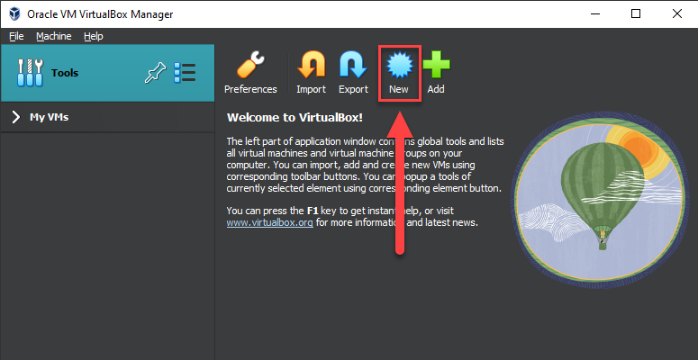

# Install Ubuntu Linux on a Virtual Machine Using VirtualBox
#  Overview
This guide explains how to use Oracle's VirtualBox software to install Ubuntu on a virtual machine. You can use this guide to install other Linux distributions, however, system requirements may vary.

This guide features:
- Windows as the host operating system
- VirtualBox version 7.0.8
- Ubuntu version 22.04.2 LTS

# Prerequisites:
Recommended minimum system requirements:
- 2 GHz dual-core processor 
- 4 GB RAM 
- 30 GB of free hard drive space  
  
# Instructions

## Step 1: Download VirtualBox

[Click here](https://www.virtualbox.org/wiki/Downloads) and download VirtualBox for your host operating system.

## Step 2: Download an Ubuntu ISO File

[Click here](https://ubuntu.com/download/desktop) and download the latest version of Ubuntu.

## Step 3: Install VirtualBox

1. Navigate to your downloads and launch VirtualBox's set up application.

2. Follow the application's directions to install VirtualBox. Leave all settings as they are.

## Step 4: Create a New Virtual Machine

1. Launch VirtualBox.

2. Click **New** to create a virtual machine.

  

## Step 5: Identify the New Virtual Machine
  
1. Enter a name for the virtual machine.   

2. Enter a destination folder for the virtual machine.  

3. Select the Ubuntu **.iso** file from your downloads.  

4. Leave **Skip Unattended Installation** unselected.  

5. Click **Next**.  

## Step 6:  Configure the Guest OS Installation   

1. Enter a username and password. The default password is **changeme**.  

2. Select **Guest Additions**.  

3. Select **Install in Background**.  

 

4. Leave **Hostname**, **Domain Name**, and **Guest Additions ISO** as they are.  

5. Click **Next**.  

## Step 7: Allocate Your Computer's Resources  

1. Select how much working memory to allocate to your virtual machine. We recommend at least 2048 MB. 

2. Select how many processors to allocate to your virtual machine. We recommend 2.

3. Leave **Enable EFI** unselected.

**Note:** You can configure resource allocation later in VirtualBox's VM Settings menu once the virtual machine is created.

4. Click **Next**.

## Step 8: Add a Virtual Hard Disk

1. Select **Create a Virtual Hard Disk** and then select the amount of storage memory you want to allocate to your virtual machine. We recommend selecting 30 GB.

2. Click **Next** and an installation summary will appear.

3. Review your installation summary and then click **Finish**.

## Step 9: Install Ubuntu

1. Navigate to the VirtualBox Manager window.

2. Click **Show**. Your new virtual machine is running in a separate window.

3. Navigate to your virtual machine. You may see a loading screen.

4. Once Ubuntu finishes loading, you will be prompted to create your login credentials. Fill out the form and leave **Use Active Directory** unselected.

5. Click **Continue**. 

6. Once Ubuntu finishes installing, a welcome screen will appear with options to personalize your new desktop environment.

Your virtual machine is now set up and ready to use.

## Further Reading

- [Upgrading Ubuntu](https://ubuntu.com/tutorials/upgrading-ubuntu-desktop#1-before-you-start)
- [VirtualBox Documentation](https://www.virtualbox.org/manual/ch01.html#virt-why-useful)
- For support, visit https://ubuntuforums.org/
